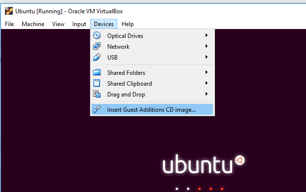

# screeps-vm-docker
This is just a setup readme, and is a work in progress.
It uses the screeps docker container provided by ags131 here https://github.com/ags131/docker-screeps-server
He also provided the docker compose outline, and wrote several of the screepsmod mods https://github.com/ScreepsMods/ that are used.

Download and install virtual box
https://www.virtualbox.org/wiki/Downloads
You should only need the "Windows hosts" platform package

Download ubuntu iso
https://www.ubuntu.com/download/server
Get the LTS release.

Run Oracle VM VirtualBox, click New
* Name and operating system, Name: Screeps Server VM, Type: Linux, Version: Ubuntu (64-bit), Next  
  
* Memory size, 4Gig Ram, Next  
  
* Create a virtual hard disk now, Create
* VDI (VirtualBox Disk Image), Next
* Dynamically allocated, Next
* File location and size, set 20GB, Create
* Select the Screeps Server VM and then Settings
* General -> Advanced -> Shared Clipboard: Bidirectional  
  
* System -> Processor: Set Processor(s) to the number of host processors  
  
* Network -> Adapter 1 -> Attached to: Bridged Adapter  
  
* OK

Attach iso to virtual box and install ubuntu
...

Insert guest additions disk  
  
Yes auto run  
enter the sudo password  
reboot the vm

sudo apt install docker-compose

mkdir screeps  
cd screeps  
copy in the docker-compose.yml:
```
version: '2'
services:
  server:
    image: 'quay.io/ags131/screeps-server'
    volumes:
      - './data/server:/screeps'
    ports:
      - 21025:21025
    links:
      - redis
      - mongo
  mongo:
    image: mongo
    volumes:
      - './data/mongo/db:/data/db'
      - './data/mongo/configdb:/data/configdb'
  redis:
    image: redis
    volumes:
      - './data/redis:/data'
```

`sudo docker-compose up`  
wait, ctrl-c

`sudo docker run -it --rm -v $PWD/data/server:/screeps quay.io/ags131/screeps-server init`

`sudo docker run --rm -v $PWD/data/server:/screeps quay.io/ags131/screeps-server yarn add screepsmod-mongo screepsmod-auth screepsmod-tickrate screepsmod-admin-utils screepsmod-features screepsmod-gcltocpu screepsmod-history screepsmod-map-tool `

sudo vi data/server/mods.json  
add into mods array
```javascript
    "node_modules/screepsmod-map-tool/index.js",
    "node_modules/screepsmod-mongo/index.js",
    "node_modules/screepsmod-auth/index.js",
    "node_modules/screepsmod-tickrate/index.js",
    "node_modules/screepsmod-admin-utils/index.js",
    "node_modules/screepsmod-features/index.js",
    "node_modules/screepsmod-gcltocpu/index.js",
    "node_modules/screepsmod-history/index.js"
```

sudo vi data/server/.screepsrc  
at the end add
```
[mongo]
host = mongo

[redis]
host = redis

[history]
mode = 'file'

[maptool]
user = admin
pass = <your password here>
```

`sudo docker-compose up -d`

`sudo docker-compose exec server npx screeps cli`  
`system.resetAllData()`  
ctrl-c twice

`sudo docker-compose restart`

`ip -4 a`

Connect using steam, or
http://&lt;ip&gt;:21025/authmod/password/

profit?
