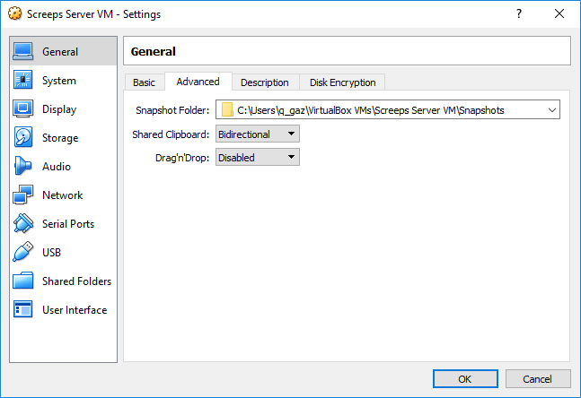
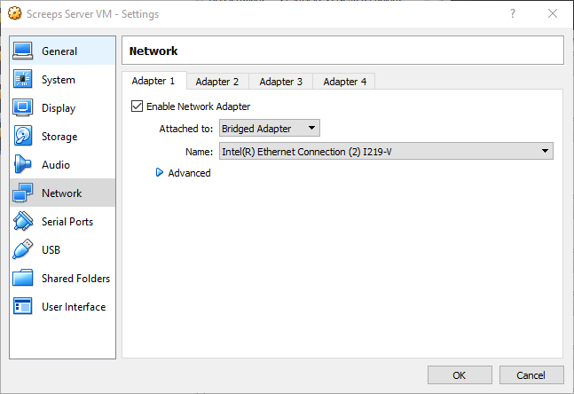

# screeps-vm-docker Virtual Machine Setup
This creates a VM with docker ready for the screeps server to run in

## Download and install virtual box
https://www.virtualbox.org/wiki/Downloads
You should only need the "Windows hosts" platform package

## Download ubuntu iso
https://www.ubuntu.com/download/server
Get the LTS release.

## Run Oracle VM VirtualBox
### Create VM
* Click New
* Name and operating system, Name: Screeps Server VM, Type: Linux, Version: Ubuntu (64-bit), Next  
  
* Memory size, 4Gig Ram, Next  
  
* Create a virtual hard disk now, Create
* VDI (VirtualBox Disk Image), Next
* Dynamically allocated, Next
* File location and size, set 20GB, Create
* Select the Screeps Server VM and then Settings
* General -> Advanced -> Shared Clipboard: Bidirectional  
  
* System -> Processor: Set Processor(s) to the number of host processors  
  
* Network -> Adapter 1 -> Attached to: Bridged Adapter  
  
* OK
### Install Ubuntu into VM
* Click Start
* Select start-up disk, browse to the Ubuntu server iso, Start  
  
* Select language (only tested with English)
* Select keyboard layout, then Done
* Select Install Ubuntu
* Make a note of the ip address (192.168.14.76 in the screenshot), Done  
  
* Proxy, leave blank (unless you need one), Done
* Mirror, leave at the default, Done
* Select Use An Entire Disk
* Select the default Disk
* Leave the default filesystem layout, Done
* Select Continue to wipe the disk (don't worry its only the virtual one)
* Enter user details, I used the following if you choose other replace them in the instructions that follow.  Remember the password! Done
  
* Select the docker Snaps, Done
* Reboot Now
* Press enter to confirm disk has been removed
* Let it reboot

### Optionally install guest additions
This allow copy and paste with the VM (can be handy to get commands and keys in)
* Insert the virtual guess additons CD.  Devices -> Insert Guest Additions CD image...
  
* login as screeps
* `sudo apt install build-essential`
* Press enter for Y
* `sudo mount /dev/cdrom /mnt`
* `cd /mnt`
* `sudo ./VBoxLinuxAdditions.run`
* `sudo reboot`

